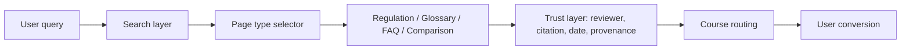

# knowledge-platform-patterns

*Reference architecture for trust-first knowledge platforms — the engineering pattern behind Higher Self's commercial builds.*

## The thesis

Most AI consulting is still chasing faster chatbots. That is the wrong hill. Categories are not won by a slightly smoother prompt loop or a more theatrical assistant persona. They are won by an authority layer: a growing reservoir of trusted, cited, human-signed pages that answer consequential questions better than aggregators, forums, and AI slop. Expertise-led businesses do not need more generated words. They need citation-grade knowledge that can survive scrutiny from buyers, reviewers, search engines, and AI discovery systems.

This repository documents that pattern in its portable form. It is not a product build, a framework, or a reusable agent stack. It is the abstracted schema and page architecture behind Higher Self's commercial work: the page types, trust signals, and content pipeline that turn hard-won expertise into durable discovery assets. The commercial moat is not the template. It is the judgement to decide which questions matter, which sources count, which experts sign, and which pages deserve to exist.

The commercial relevance is straightforward. An Upwork buyer needs to see senior engineering judgement, not a pile of prompts. A founder evaluating a platform engagement needs to see how authority becomes a system, not a slogan. A peer needs to see that the abstractions were earned in production, not assembled from framework discourse. The repository is therefore written as an artefact of proof. Every file is here to make the pattern inspectable.

## The architecture

The shape is intentionally simple. A user query enters through search, lands on a structured page type, passes through a visible trust layer, and routes into the course or service that resolves the need behind the query. That simplicity matters because authority compounds when the surface area is legible. Freeform content sprawls. Structured content accumulates. Each page type does one job. Each trust signal reduces ambiguity. Each route from answer to offer respects the fact that high-intent visitors are looking for certainty, not copy.

The pattern assumes that published knowledge is not an afterthought to sales or SEO. It is part of the product surface. Regulation pages answer specific compliance questions. Glossary entries define terms that buyers need before they can act. FAQ pages intercept buyer-intent queries. Comparison pages help a visitor choose a path without falling into generic listicle territory. The trust layer holds the whole thing together, because a page without a reviewer, a source, a date, and provenance is just another opinion on the internet.

That is also why the repository stays narrow. It does not try to solve orchestration infrastructure, hosting, analytics plumbing, or publishing tooling. Those decisions vary by team. The invariant is the pattern: structured answers, visible trust signals, and an explicit route from authority to action. When those pieces are present, the corpus becomes an asset instead of a content backlog.

## The four page types

| Page type | What it does | When to use it |
| --- | --- | --- |
| Regulation pages | Explain a regulation, duty, or compliance requirement with primary-source citation, named review, and change tracking. | Use when the query is consequential, source-led, and likely to be checked against official guidance. |
| Glossary entries | Define a term with acronym expansion, regulatory context, examples, and related terms. | Use when the visitor needs conceptual clarity before they can evaluate a course, service, or requirement. |
| FAQ pages | Answer a buyer-intent question with a quick-answer pill, a fuller response, and an escalation call to action. | Use when the query signals commercial intent and the visitor needs a fast, trustworthy answer. |
| Comparison pages | Distinguish one pathway, standard, or option from another with a comparison table and route onward. | Use when the user is deciding between adjacent terms, credentials, or compliance paths. |

The point is not content variety for its own sake. It is to keep every answer legible to machines, credible to humans, and reusable across the long tail of real queries. Structured page types are how authority gets captured instead of dissipating.

## The trust layer

Named expert reviewer: every page carries a real reviewer with credentials because anonymous expertise is indistinguishable from content farm output.

Primary-source citation with working link: every material claim traces back to a source a reader can inspect because trust-first systems do not ask the user to take the page on faith.

Last-reviewed date: every page shows when a human last checked it because undated compliance content ages into risk.

Change tracking against previous versions: every substantive update leaves a visible trail because authority is strengthened by responsible revision, not by pretending nothing changed.

Auditable content provenance: every page records who authored it, when it was reviewed, and whether fact-checking passed because citation-grade publishing requires a chain of custody.

This is where the pattern breaks from AI content farms. The output is not trusted because an LLM produced it fluently. It is trusted because the page makes its own accountability visible.

## The agent pipeline

Researcher: gathers the primary sources, working links, and source extracts that a page is allowed to rely on.

Outliner: converts those sources into a page structure with citation anchors placed before prose exists.

Author: writes to the structure and may not introduce unsupported claims between anchors.

Fact-checker: verifies every claim against the cited source and either rejects the draft or passes it forward.

Publisher: renders the approved page with provenance, routing, dates, and reviewer information intact.

The pattern matters because it fails closed. A single-LLM prompt can write something persuasive and wrong in the same breath. A staged pipeline forces evidence before fluency, and the fact-checker is allowed to kill the page. That is how you scale content without scaling AI slop.

## Who this is for

This repository is for training providers, consultancies, certification bodies, regulated services firms, and B2B products with deep domain knowledge that should already be compounding into discoverable authority. It fits teams whose buyers ask high-stakes questions before they buy, whose answers need sources and named reviewers, and whose commercial surface is shaped by expertise rather than entertainment. It is especially relevant to expertise-led businesses that are tired of publishing generic SEO pages which rank weakly, convert poorly, and erode credibility with the very buyers they need.

If your market rewards fast takes, trend surfing, or anonymous volume publishing, this pattern is the wrong fit. If your market rewards being right, being sourceable, and being visibly accountable, this is the infrastructure pattern worth copying.

## Status and licence

This is an evolving pattern library drawn from production work at Higher Self. The schemas and templates are being progressively published in abstracted form. The repository is MIT licensed. Commercial questions belong at higherself.ai.

## Getting started

Clone the repository. Read `ARCHITECTURE.md`. Validate `examples/work-at-height-2005/content.json` against `schemas/regulation-page.schema.json`. Then decide the real question: do you want the pattern alone, or do you want the human-curated implementation discipline that makes a trust-first knowledge platform actually work?

[github.com/davidandrewbentley](https://github.com/davidandrewbentley) · [higherself.ai](https://higherself.ai/)
