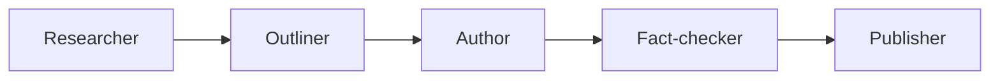

# Agent pipeline

The agent pipeline exists for one reason: citation-grade pages should be assembled in the order evidence requires, not in the order an LLM finds most convenient. The pattern uses five distinct stages with hard handoffs. Implementation details are intentionally out of scope here. What matters is the workflow contract.

## Researcher

The Researcher gathers the allowed source set: primary documents, official guidance, stable links, retrieval dates, and short extracts that justify why each source is in scope. This stage is narrower than general research. It is not looking for interesting things to say. It is building the evidence boundary for the page.

## Outliner

The Outliner turns source material into structure. It decides what the page must cover, where the claims will sit, and which citations support each section before any fluent prose exists. This is the anti-slop move. When citation anchors come first, the page is forced to respect the evidence map instead of improvising one later.

## Author

The Author writes against the outline and its anchors. The role is expressive, but bounded. It can explain, clarify, and connect, yet it may not introduce new unsupported facts just because they would make the draft read more smoothly. The job is to convert evidence-backed structure into clean prose, not to decorate the page with plausible extras.

## Fact-checker

The Fact-checker is the gate. It inspects each claim against the cited source and decides whether the draft passes or fails. This stage is not a light edit. It is a hard control. Unsupported claims, broken links, mismatched citations, or overreaching interpretations are grounds for rejection. The pipeline is designed so the checker can stop publication without negotiation.

That fail-closed stance matters because content systems otherwise drift toward permissive publishing. A draft that is ninety-five percent right still damages the corpus if the remaining five percent is wrong in a consequential way. One unsupported statement can cause a buyer to distrust the rest of the page, or worse, act on bad guidance. Rejecting that page is cheaper than repairing the trust it would break.

Fail-closed checking also changes upstream behaviour. Researchers gather cleaner sources. Outliners become stricter about anchor placement. Authors learn that elegance without evidence is wasted effort. The whole system becomes more disciplined because the last gate is real.

## Publisher

The Publisher renders only approved drafts. It attaches provenance, reviewer data, dates, citations, and routing so the page goes live with accountability intact. Publishing is therefore not a formatting step alone. It is the final preservation of the trust signals that make the page useful.

The pattern is the artefact, not the code. Any implementation that preserves these handoffs and this discipline is compatible with the model described here. That keeps the repository portable across stacks, teams, and publishing environments without weakening the editorial control model. The architecture is abstract on purpose so teams can adopt the pattern without inheriting somebody else's stack choices.
